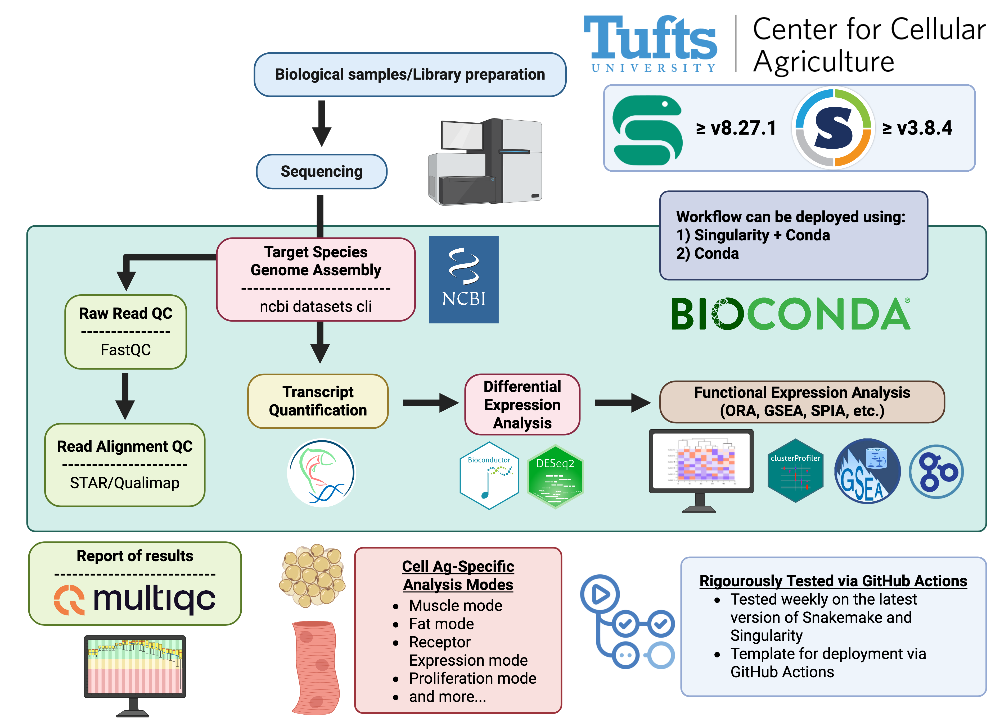

  

**`tucca-cellag/tucca-rna-seq`** is the
[Tufts University Center for Cellular Agriculture's (TUCCA)][1] RNA-Seq
workflow specifically designed for cellular agriculture projects.

This workflow was developed using the [Snakemake][1.5] workflow management
system. `tucca-rna-seq` is a standardized usage Snakemake workflow that follows
the [best practices][2.5] laid out in the Snakemake documentation (as of
Snakemake v9.3) and can be found in the [Snakemake Workflow Catalog][3].

> [!WARNING]
> This workflow is still under construction. Please do not expect this workflow
> and associated documentation to be complete until version 1.0.0 has been
> released. In the meantime, feel free to [contact us][contact] with any
> questions.

## Documentation

The usage of this workflow is described in our documentation at
[tucca-cellag.github.io][2]. If you've found a bug or there is a feature that
we're missing (in the workflow or in our documentatio) please
[open an issue][5] to let us know.

## Workflow Overview

<h1 style="text-align:center;">
  <picture>
    
  </picture>
</h1>

Created in [https://BioRender.com](https://BioRender.com)

## How do I get help?

For questions or suggestions regarding the workflow, first, check out our
detailed documentation at [tucca-cellag.github.io][2]. If you can't find the
answer to your question in our documentation you can try checking if someone
has [previously opened an issue][4] answering your question. If you still have
a question please [open an issue][5] so we can help! For any other inquiries,
please contact us via [email][contact].

## Citing the Workflow

If you use this workflow in a paper, don't forget to give credits to the
authors by citing the URL of this (original) repository and its DOI (above if
available). You can also 

## What is Cellular Agriculture? 🧬🌱

**Cellular Agriculture** is a cutting-edge field that harnesses biotechnology
to produce agricultural products directly from cells. Unlike traditional
farming, which relies on raising and harvesting whole organisms, cellular
agriculture focuses on cultivating animal cells in controlled environments to
create sustainable alternatives for meat, dairy, and other animal-derived
products.

### **Why Cellular Agriculture Matters**

- **Sustainability 🌍:** Reduces the environmental impact associated with
  conventional agriculture, including lower greenhouse gas emissions, reduced
  land and water usage, and minimized waste production.
- **Ethical Considerations 🐮❤️:** Offers humane alternatives by eliminating the
  need for animal slaughter, addressing animal welfare concerns.
- **Food Security 🍽️:** Enhances the ability to produce food in areas with
  limited agricultural resources, contributing to global food security.
- **Innovation and Research 🔬:** Drives advancements in biotechnology,
  genetics, and bioinformatics, fostering interdisciplinary collaboration and
  novel scientific discoveries.

## Contributing

We welcome your involvement in the development of this workflow via submission
of bug reports, proposing new features, engaging in discussions, or providing
fixes and other code modifications. If you're interested in contributing,
please consult the [contributing guidelines][6]. For all interactions within
the `tucca-cellag` community, we ask that you observe our [code of conduct][7].

&copy; 2025 [Tufts University Center for Cellular Agriculture][1]

[1]: https://cellularagriculture.tufts.edu/
[1.5]: https://snakemake.readthedocs.io/en/stable/
[2]: https://tucca-cellag.github.io/tucca-rna-seq/introduction
[2.5]: https://snakemake.readthedocs.io/en/stable/snakefiles/best_practices.html
[3]: https://snakemake.github.io/snakemake-workflow-catalog/docs/workflows/tucca-cellag%20tucca-rna-seq.html
[4]: https://github.com/tucca-cellag/tucca-rna-seq/issues
[5]: https://github.com/tucca-cellag/tucca-rna-seq/issues/new
[contact]: <mailto:benjamin.bromberg@tufts.edu>
[6]: CONTRIBUTING.md
[7]: CODE_OF_CONDUCT.md
